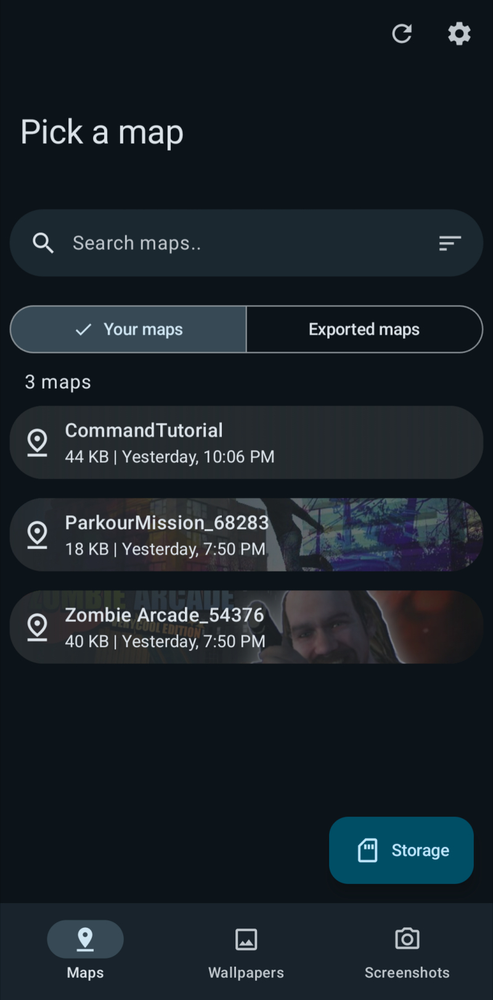

  
  
  # LAC Tool
  Do most <a href="https://play.google.com/store/apps/details?id=com.MA.LAC">LAC</a> related stuff without having to mess with files

   

  
  
  

    
  
  
  

## 💡 Features
- LAC map management
- LAC map role & option management
- LAC map merging
- LAC in game cellphone wallpaper management
- Import LAC in game cellphone wallpapers without internet connection
- LAC in game screenshot management

## 🔧 Building
- Clone the repository
- Do your changes
- `./gradlew assembleRelease`
